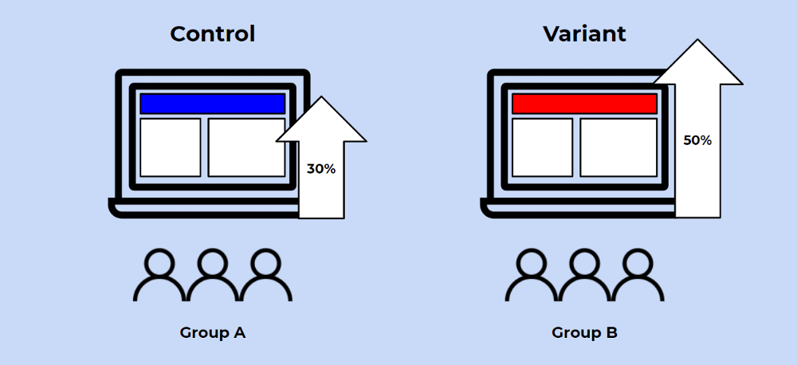

# AB_Testing




# A/B Testing Examples

This repo contains the notebook [AB-Testing.ipynb](AB_Testing.ipynb) where you
can find different worked examples of [A/B
Testing](https://en.wikipedia.org/wiki/A/B_testing).


# Installation

The code was tested with Python 3.8 on Mac OS X and Linux. To make sure you
have the right dependencies, please install the requirements as follows:

```commandline
pip install -r requirements.txt
